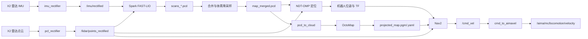

# AgiBot Lingxi X2：SLAM 建图、定位与导航

> A community-driven ROS 2 navigation framework for the AgiBot Lingxi X2.

本仓库提供一套面向智元灵犀 X2 人形机器人的 ROS 2 流程，覆盖：

- 激光雷达与 IMU 数据校正；
- 基于 Spark FAST-LIO 的三维点云建图；
- PCD 地图合并与降采样；
- 基于 NDT-OMP 的点云定位；
- 使用 OctoMap 将三维点云投影为 Nav2 二维栅格地图；
- Nav2 路径规划、点云避障；
- 将 Nav2 的 `/cmd_vel` 转换为 X2 AIMDK 运动控制消息。

本文档根据仓库当前代码，以及“灵犀 X2 SLAM 建图与定位”和“灵犀 X2
路线规划与导航”课程课件整理。课件中的少数包名、文件名和路径与当前代码
不一致，本文均以仓库实际内容为准。

> [!CAUTION]
> 本项目会向实体机器人发送运动指令。首次运行时必须保证现场空旷、有人员
> 看护并随时可以急停。建议先只启动感知、建图和定位，确认 TF、地图与位姿
> 正常后再启动速度桥接；首次导航目标建议放在机器人前方 0.5 m 以内。

## 1. 系统流程



## 2. 主要目录

| 路径 | 用途 |
| --- | --- |
| `src/py_examples` | X2 AIMDK 示例、雷达/IMU 校正、PCD 发布等 Python 节点 |
| `src/spark-fast-lio/spark_fast_lio` | 本文采用的 Spark FAST-LIO 建图包 |
| `src/lidar_localization_ros2` | PCD 地图加载与 NDT-OMP 点云定位 |
| `src/ndt_omp_ros2` | 多线程 NDT/GICP 配准后端 |
| `src/my_nav2_pointcloud_pkg` | Nav2 启动、参数、地图和 X2 速度桥接 |
| `src/aimdk_msgs` | X2 AIMDK 消息与服务定义 |
| `src/FAST_LIO_ROS2` | 另一套 FAST-LIO 实现，不是本文课程流程的默认实现 |
| `src/agibot_nav` | 另一套导航配置，不是本文默认使用的 Nav2 启动包 |
| `src/livox_ros_driver2` | Livox 驱动源码；X2 课程流程直接使用 AIMDK 已发布的话题 |

仓库中的 YOLO、目标检测、手势识别和相机示例属于可选视觉感知内容，不参与
本文的 SLAM、定位和导航主流程。

## 3. 运行环境

建议使用以下环境：

- Ubuntu 22.04；
- ROS 2 Humble；
- Python 3；
- X2 与运行 ROS 2 的计算机处于可互通的网络中；
- X2 端 AIMDK/传感器服务已启动。

ROS 2 Humble 官方支持 Ubuntu 22.04 的 amd64 与 arm64 平台。安装 ROS 2
时请优先参考 [ROS 2 Humble 官方安装文档](https://docs.ros.org/en/humble/Installation.html)。

### 3.1 获取代码

本文统一把工作空间放在 `~/agibot_ws`，这样也与仓库内部分课程配置的默认
路径一致：

```bash
git clone https://github.com/Nova-Valley/agibot-x2-navigation.git ~/agibot_ws
cd ~/agibot_ws
```

如果已经下载了仓库，不需要重新克隆，只需把后文的 `AGIBOT_WS` 改为实际
绝对路径：

```bash
export AGIBOT_WS="/你的实际路径/agibot-x2-navigation"
```

### 3.2 安装依赖

先安装 ROS 2、Nav2、OctoMap、PCL 和构建工具：

```bash
sudo apt update
sudo apt install -y \
  build-essential \
  cmake \
  git \
  libeigen3-dev \
  libomp-dev \
  libpcl-dev \
  python3-colcon-common-extensions \
  python3-pip \
  python3-rosdep \
  ros-humble-desktop \
  ros-humble-navigation2 \
  ros-humble-nav2-bringup \
  ros-humble-octomap-server \
  ros-humble-pcl-conversions \
  ros-humble-pcl-ros \
  ros-humble-sensor-msgs-py
```

PCD 合并和发布节点使用 Open3D：

```bash
python3 -m pip install --user numpy open3d
```

然后让 `rosdep` 补齐各 ROS 包声明的依赖：

```bash
source /opt/ros/humble/setup.bash
cd ~/agibot_ws

# 仅在本机从未初始化 rosdep 时执行；如果提示已经初始化，可忽略。
sudo rosdep init
rosdep update
rosdep install \
  --from-paths \
    src/aimdk_msgs \
    src/py_examples \
    src/spark-fast-lio/spark_fast_lio \
    src/ndt_omp_ros2 \
    src/lidar_localization_ros2 \
    src/my_nav2_pointcloud_pkg \
  --ignore-src -r -y --rosdistro humble
```

### 3.3 编译

创建 FAST-LIO 的点云输出目录：

```bash
cd ~/agibot_ws
mkdir -p src/spark-fast-lio/spark_fast_lio/PCD
```

推荐只编译本流程需要的包：

```bash
source /opt/ros/humble/setup.bash
cd ~/agibot_ws

colcon build \
  --symlink-install \
  --cmake-args -DCMAKE_BUILD_TYPE=Release \
  --packages-up-to \
    py_examples \
    spark_fast_lio \
    lidar_localization_ros2 \
    my_nav2_pointcloud_pkg
```

仓库中的 `livox_ros_driver2` 需要与平台匹配的 Livox SDK 库。直接执行不带
包范围的 `colcon build`，可能会因本机没有对应预编译库而失败；本文流程从
AIMDK 话题取数，不要求编译该驱动。

编译完成后检查关键可执行程序：

```bash
source ~/agibot_ws/install/setup.bash

ros2 pkg executables py_examples | grep -E 'pcl_rectifier|imu_rectifier|pcd_to_cloud'
ros2 pkg executables my_nav2_pointcloud_pkg | grep -E 'cmd_to_aimavel|send_goal'
ros2 pkg executables spark_fast_lio
```

## 4. 每个终端都要执行

后面的步骤需要同时打开多个终端。每打开一个新终端，都先执行：

```bash
export AGIBOT_WS="$HOME/agibot_ws"
source /opt/ros/humble/setup.bash
source "$AGIBOT_WS/install/setup.bash"
```

如果 X2 与上位机设置了 `ROS_DOMAIN_ID`，所有终端必须使用相同的值。例如：

```bash
export ROS_DOMAIN_ID=0  # 把 0 替换为机器人实际使用的数字
```

## 5. 建图前检查

本仓库不负责启动 X2 底层传感器服务。连接机器人并启动 AIMDK 后，先确认
ROS 2 能发现传感器话题：

```bash
ros2 topic list | grep -E 'lidar|imu|aima'
```

课程使用的原始雷达话题是：

```text
/aima/hal/sensor/lidar_chest_front/lidar_pointcloud
```

确认点云持续到达：

```bash
ros2 topic hz /aima/hal/sensor/lidar_chest_front/lidar_pointcloud
```

仓库的话题清单记录的雷达 IMU 是：

```text
/aima/hal/lidar_chest_front/imu
```

而 `imu_rectifier` 源码默认订阅：

```text
/aima/hal/sensor/lidar_chest_front/imu
```

因此必须以机器人实际输出为准：

```bash
ros2 topic list | grep 'lidar_chest_front/imu'
```

如果雷达或 IMU 没有数据，先排查机器人端服务、网络、`ROS_DOMAIN_ID` 和
DDS 配置，不要继续启动 SLAM。

## 6. 三维点云建图

建图时让机器人缓慢、平稳地覆盖目标区域。尽量经过有墙面、立柱、家具等
几何特征的位置，避免长时间面对纯白墙、玻璃、大面积空旷区或剧烈晃动。

### 6.1 终端 A：校正雷达点云

```bash
ros2 run py_examples pcl_rectifier
```

它将原始点云转换到以下话题和坐标系：

```text
输出话题：/lidar/points_rectified
frame_id：lidar_chest_front
```

检查输出：

```bash
ros2 topic hz /lidar/points_rectified
```

### 6.2 终端 B：校正 IMU

如果机器人发布的是源码默认话题：

```bash
ros2 run py_examples imu_rectifier
```

如果机器人实际发布的是仓库话题清单中的
`/aima/hal/lidar_chest_front/imu`，使用重映射：

```bash
ros2 run py_examples imu_rectifier --ros-args \
  -r /aima/hal/sensor/lidar_chest_front/imu:=/aima/hal/lidar_chest_front/imu
```

检查输出：

```bash
ros2 topic hz /imu/rectified
```

### 6.3 终端 C：发布 `map -> odom` 静态 TF

课程流程把 `map` 与建图使用的 `odom` 原点对齐：

```bash
ros2 run tf2_ros static_transform_publisher \
  0 0 0 0 0 0 map odom
```

### 6.4 终端 D：启动 Spark FAST-LIO

```bash
ros2 launch spark_fast_lio mapping_agibot.launch.yaml
```

该启动文件会自动打开 RViz，并订阅：

```text
/lidar/points_rectified
/imu/rectified
```

当前仓库的主要建图参数在：

```text
src/spark-fast-lio/spark_fast_lio/config/robosense-e1r.yaml
```

其中：

- `pcd_save.pcd_save_en: true`：启用 PCD 保存；
- `pcd_save.interval: 50`：每 50 帧生成一个 PCD 分片；
- `mapping.extrinsic_T` 和 `mapping.extrinsic_R`：雷达与 IMU 外参；
- `preprocess.blind: 2.5`：近距离盲区过滤；
- `preprocess.scan_line: 6`、`scan_rate: 10`：当前雷达扫描配置。

只有在确认硬件、雷达固件或外参发生变化时才修改这些参数。

### 6.5 结束建图

完成路线后，让机器人停稳，然后在 FAST-LIO 终端按 `Ctrl+C` 正常退出。
检查点云分片：

```bash
cd "$AGIBOT_WS/src/spark-fast-lio/spark_fast_lio/PCD"
ls -lh scans_*.pcd
```

> [!NOTE]
> `*.pcd` 和 `spark_fast_lio/PCD/*` 被 `.gitignore` 排除，因此运行生成的
> 地图默认不会上传到 GitHub。这是为了避免把体积很大的场景数据提交到代码
> 仓库，并不表示建图失败。

## 7. 合并 PCD 地图

仓库根目录的 `merge_pcd.py` 当前是空占位文件，而实际运行目录下的脚本又
被 `.gitignore` 排除。为保证从 GitHub 新克隆后也能完成课程流程，可在 PCD
目录创建下面的脚本：

```bash
cd "$AGIBOT_WS/src/spark-fast-lio/spark_fast_lio/PCD"
nano merge_pcd.py
```

粘贴以下内容并保存：

```python
import glob
import re

import open3d as o3d


def natural_key(path):
    return [
        int(text) if text.isdigit() else text
        for text in re.split(r"(\d+)", path)
    ]


pcd_files = sorted(glob.glob("scans_*.pcd"), key=natural_key)
if not pcd_files:
    raise FileNotFoundError("当前目录没有 scans_*.pcd")

merged = o3d.geometry.PointCloud()
for filename in pcd_files:
    print("loading", filename)
    merged += o3d.io.read_point_cloud(filename)

print("total raw points:", len(merged.points))
merged = merged.voxel_down_sample(voxel_size=0.05)
print("after voxel:", len(merged.points))
merged.estimate_normals()

o3d.io.write_point_cloud(
    "map_merged.pcd",
    merged,
    write_ascii=False,
    compressed=False,
)
print("saved map_merged.pcd")
```

运行合并：

```bash
python3 merge_pcd.py
ls -lh map_merged.pcd
```

如果地图过大，可把 `voxel_size=0.05` 调大到 `0.10`；地图会更小、处理更快，
但细节也会减少。

## 8. 生成 Nav2 二维地图

本步骤把 `map_merged.pcd` 发布为 ROS 点云，再由 OctoMap 生成
`/projected_map`，最后保存为 `projected_map.pgm` 和
`projected_map.yaml`。

### 8.1 终端 A：发布 PCD

```bash
export MAP_PCD="$AGIBOT_WS/src/spark-fast-lio/spark_fast_lio/PCD/map_merged.pcd"

ros2 run py_examples pcd_to_cloud --ros-args \
  -p pcd_path:="$MAP_PCD" \
  -p topic_name:=/cloud_pcd \
  -p frame_id:=map \
  -p publish_rate:=0.2
```

### 8.2 终端 B：启动 OctoMap

```bash
ros2 launch spark_fast_lio octomap.launch.xml
```

这里必须使用 `octomap.launch.xml`。仓库里的 `octomap.launch.py` 实际包含
XML 内容，不能作为 Python launch 文件执行；课件里出现的包名
`spark_fastlio` 也应改为仓库真实包名 `spark_fast_lio`。

检查二维投影：

```bash
ros2 topic info /projected_map
ros2 topic echo /projected_map --once
```

### 8.3 终端 C：保存地图

```bash
mkdir -p "$AGIBOT_WS/src/my_nav2_pointcloud_pkg/maps"

ros2 run nav2_map_server map_saver_cli \
  -f "$AGIBOT_WS/src/my_nav2_pointcloud_pkg/maps/projected_map" \
  --ros-args -r map:=/projected_map
```

确认两个文件都已生成：

```bash
ls -lh \
  "$AGIBOT_WS/src/my_nav2_pointcloud_pkg/maps/projected_map.pgm" \
  "$AGIBOT_WS/src/my_nav2_pointcloud_pkg/maps/projected_map.yaml"

head -n 1 "$AGIBOT_WS/src/my_nav2_pointcloud_pkg/maps/projected_map.yaml"
```

第一行应为：

```yaml
image: projected_map.pgm
```

仓库原始 `projected_map.yaml` 写的是 `image: my_map.pgm`，但仓库中没有该
文件；重新运行 `map_saver_cli` 通常会生成正确值。如果仍不正确，请手动
改为上面的文件名。

地图更新后重新安装导航包：

```bash
cd "$AGIBOT_WS"
colcon build --symlink-install --packages-select my_nav2_pointcloud_pkg
source "$AGIBOT_WS/install/setup.bash"
```

## 9. 点云定位

默认配置 `use_imu: false`，因此定位本身只要求运行第 6.1 节的点云校正
节点，不要再启动 FAST-LIO 建图节点。如果后续把 `use_imu` 改为 `true`，
还需要同时运行第 6.2 节的 IMU 校正节点。

### 9.1 修改定位配置

打开：

```bash
nano "$AGIBOT_WS/src/lidar_localization_ros2/param/localization.yaml"
```

至少检查以下参数：

```yaml
map_path: "/home/你的用户名/agibot_ws/src/spark-fast-lio/spark_fast_lio/PCD/map_merged.pcd"
set_initial_pose: false
initial_pose_qw: 1.0
enable_map_odom_tf: false
```

注意：

- `map_path` 必须是当前机器上的绝对路径，不能照抄其他用户的
  `/home/ubuntu/...`；
- 使用 RViz 的 “2D Pose Estimate” 手工给初始位姿时，将
  `set_initial_pose` 设为 `false`；
- 仓库原始配置的 `initial_pose_qw` 为 `0.0`，不是有效的单位四元数。
  即使手工设初始位姿，也建议改为 `1.0`；
- 是否启用 `enable_map_odom_tf` 取决于机器人是否已经提供
  `odom -> base_link`，详见下一节。

改完后重新编译定位包：

```bash
cd "$AGIBOT_WS"
colcon build \
  --symlink-install \
  --cmake-args -DCMAKE_BUILD_TYPE=Release \
  --packages-select lidar_localization_ros2
source "$AGIBOT_WS/install/setup.bash"
```

### 9.2 选择正确的 TF 模式

先检查机器人系统是否已经持续发布 `odom -> base_link`：

```bash
ros2 run tf2_ros tf2_echo odom base_link
```

根据结果二选一，不能混用：

**模式 A：课程默认模式，机器人没有独立的 `odom -> base_link`**

保持：

```yaml
enable_map_odom_tf: false
```

然后另开终端发布静态 `map -> odom`：

```bash
ros2 run tf2_ros static_transform_publisher \
  0 0 0 0 0 0 map odom
```

此时定位节点直接发布 `map -> base_link`。

**模式 B：机器人已经发布动态 `odom -> base_link`**

改为：

```yaml
enable_map_odom_tf: true
```

不要再运行静态 `map -> odom`。定位节点会根据实时
`map -> base_link` 与已有 `odom -> base_link` 计算并发布
`map -> odom`。

如果两种模式混用，可能出现 TF 重复发布、坐标跳变或 Nav2 报
“multiple authority / transform unavailable”。

> [!IMPORTANT]
> 静态 TF 只能建立坐标关系，不能代替 `nav_msgs/msg/Odometry` 数据。当前
> Nav2 参数仍使用 `/odom` 作为里程计话题；进入导航阶段前还要按第 10 节
> 确认该话题存在。

### 9.3 启动定位

终端 A：

```bash
rviz2 -d "$AGIBOT_WS/src/lidar_localization_ros2/rviz/agibot.rviz"
```

终端 B：

```bash
ros2 launch lidar_localization_ros2 lidar_localization.launch.py
```

在 RViz 中：

1. 确认 `Fixed Frame` 为 `map`；
2. 检查 PCD 地图和实时点云是否显示；
3. 点击工具栏的 **2D Pose Estimate**；
4. 在地图上点击机器人当前实际位置，并拖动箭头指定朝向；
5. 观察实时点云是否迅速与地图重合。

验证定位输出：

```bash
ros2 topic echo /pcl_pose --once
ros2 run tf2_ros tf2_echo map base_link
```

如果点云明显错位，先重新设置初始位姿；仍无法对齐时，再检查地图路径、
雷达 frame、传感器时间戳、TF 和 NDT 参数。

## 10. Nav2 路径规划与导航

在启动 Nav2 前，必须同时满足：

- `/lidar/points_rectified` 持续有数据；
- 定位节点已经输出稳定的 `/pcl_pose`；
- `map -> base_link` 和 `odom -> base_link` 均可查询；
- `/odom` 持续发布 `nav_msgs/msg/Odometry`；
- `projected_map.yaml` 能找到同目录下的 `projected_map.pgm`；
- 机器人周围无人员和障碍，急停可用。

当前 `nav2_params.yaml` 默认使用 `/odom`。启动 Nav2 前检查：

```bash
ros2 topic type /odom
ros2 topic hz /odom
```

类型应为 `nav_msgs/msg/Odometry`。如果 X2 使用了其他里程计话题，应将它
重映射为 `/odom`，或同步修改 Nav2 各节点的 `odom_topic` 参数。若机器人
系统完全没有里程计消息，需要先接入可靠的里程计来源；不要用静态 TF 冒充
里程计，也不要启动速度桥接。

### 10.1 终端 A：启动 Nav2

```bash
ros2 launch my_nav2_pointcloud_pkg nav2_bringup.launch.py
```

如需显式指定地图、参数和点云话题：

```bash
ros2 launch my_nav2_pointcloud_pkg nav2_bringup.launch.py \
  map:="$AGIBOT_WS/src/my_nav2_pointcloud_pkg/maps/projected_map.yaml" \
  params_file:="$AGIBOT_WS/src/my_nav2_pointcloud_pkg/config/nav2_params.yaml" \
  pointcloud_topic:=/lidar/points_rectified
```

检查 Nav2 生命周期节点：

```bash
ros2 lifecycle get /map_server
ros2 lifecycle get /planner_server
ros2 lifecycle get /controller_server
ros2 action list | grep navigate
```

### 10.2 先观察 `/cmd_vel`，不要立即控制机器人

在速度桥接未启动时，先用 RViz 的 **2D Goal Pose** 设置一个近距离目标，
确认规划路径合理，并观察 Nav2 输出：

```bash
ros2 topic echo /cmd_vel
```

如果 Nav2 没有 `/cmd_vel`，重点检查终端日志、地图、初始位姿与 TF。

### 10.3 终端 B：启动 X2 速度桥接

课件中的 `cmd_toaimvel` 不是当前仓库的可执行程序名。正确名称是：

```text
cmd_to_aimavel
```

首次实机测试建议使用较低限速：

```bash
ros2 run my_nav2_pointcloud_pkg cmd_to_aimavel --ros-args \
  -p forward_scale:=0.5 \
  -p lateral_scale:=0.5 \
  -p angular_scale:=0.5 \
  -p max_forward_speed:=0.20 \
  -p min_forward_speed:=0.05 \
  -p max_lateral_speed:=0.10 \
  -p min_lateral_speed:=0.05 \
  -p max_angular_speed:=0.35 \
  -p min_angular_speed:=0.05
```

该节点会：

1. 通过 `/aimdk_5Fmsgs/srv/SetMcInputSource` 注册名为 `nav2` 的输入源；
2. 订阅 Nav2 的 `/cmd_vel`；
3. 发布 `/aima/mc/locomotion/velocity`；
4. 在超过 0.5 秒未收到新 `/cmd_vel` 时自动清零；
5. 收到 `Ctrl+C` 或终止信号时先发布零速度再退出。

如果服务注册失败，检查：

```bash
ros2 service list | grep SetMcInputSource
ros2 topic info /aima/mc/locomotion/velocity
```

### 10.4 发送目标

在 RViz 中点击 **2D Goal Pose**，先选择机器人附近、路径上无障碍的位置。
路径出现且方向正确后，再允许机器人执行。

仓库也提供：

```bash
ros2 run my_nav2_pointcloud_pkg send_goal
```

但该脚本的目标坐标目前写在源码中，运行前应先检查
`src/my_nav2_pointcloud_pkg/my_nav2_pointcloud_pkg/send_goal.py`，不要在
未知坐标下直接对实体机器人执行。

### 10.5 安全停止顺序

需要停止系统时：

1. 先在 `cmd_to_aimavel` 终端按 `Ctrl+C`；
2. 确认 `/aima/mc/locomotion/velocity` 已归零、机器人停止；
3. 再停止 Nav2、定位、雷达/IMU 校正和 RViz；
4. 如机器人没有停止，立即使用实体急停。

## 11. 一次完整运行的终端清单

### 建图阶段

| 终端 | 命令 |
| --- | --- |
| A | `ros2 run py_examples pcl_rectifier` |
| B | `ros2 run py_examples imu_rectifier`，必要时按第 6.2 节重映射 |
| C | `ros2 run tf2_ros static_transform_publisher 0 0 0 0 0 0 map odom` |
| D | `ros2 launch spark_fast_lio mapping_agibot.launch.yaml` |

完成后：停止 FAST-LIO，合并 `scans_*.pcd`，生成 `map_merged.pcd`。

### 二维地图生成阶段

| 终端 | 命令 |
| --- | --- |
| A | `ros2 run py_examples pcd_to_cloud ...` |
| B | `ros2 launch spark_fast_lio octomap.launch.xml` |
| C | `ros2 run nav2_map_server map_saver_cli ...` |

### 定位与导航阶段

| 终端 | 命令 |
| --- | --- |
| A | `ros2 run py_examples pcl_rectifier` |
| B | 默认定位可省略；启用 `use_imu` 时运行 `imu_rectifier`，必要时重映射 |
| C | 模式 A 才运行静态 `map -> odom` |
| D | `ros2 launch lidar_localization_ros2 lidar_localization.launch.py` |
| E | `rviz2 -d .../lidar_localization_ros2/rviz/agibot.rviz` |
| F | `ros2 launch my_nav2_pointcloud_pkg nav2_bringup.launch.py` |
| G | 最后启动 `ros2 run my_nav2_pointcloud_pkg cmd_to_aimavel ...` |

## 12. 常见问题

### `Package '...' not found`

```bash
source /opt/ros/humble/setup.bash
source "$AGIBOT_WS/install/setup.bash"
ros2 pkg list | grep '要查找的包名'
```

如果仍找不到，回到工作空间重新编译对应包。

### FAST-LIO 启动了但地图不更新

```bash
ros2 topic hz /lidar/points_rectified
ros2 topic hz /imu/rectified
ros2 topic echo /lidar/points_rectified --once --field header
ros2 topic echo /imu/rectified --once --field header
```

检查两个话题是否持续发布、时间戳是否正常，以及 IMU 是否因原始话题名不同
而没有收到数据。

### 找不到 `map_merged.pcd`

```bash
find "$AGIBOT_WS/src/spark-fast-lio/spark_fast_lio/PCD" \
  -maxdepth 1 -name '*.pcd' -print
```

如果只有 `scans_*.pcd`，执行第 7 节的合并脚本。如果一个分片都没有，检查
`robosense-e1r.yaml` 中 `pcd_save_en` 是否为 `true`。

### OctoMap 没有 `/projected_map`

```bash
ros2 topic hz /cloud_pcd
ros2 node list | grep octomap
ros2 topic list | grep -E 'octomap|projected_map'
```

确保 PCD 发布到 `/cloud_pcd`，并使用 `octomap.launch.xml`。

### 定位一直等待初始位姿

确认：

```yaml
set_initial_pose: false
```

然后在 RViz 使用 **2D Pose Estimate**。如果改过源目录配置，记得重新编译
并重新 `source install/setup.bash`。

### Nav2 报 transform timeout

逐项检查：

```bash
ros2 run tf2_ros tf2_echo map base_link
ros2 run tf2_ros tf2_echo odom base_link
ros2 run tf2_ros tf2_echo map odom
```

确保第 9.2 节的两种 TF 模式只选择一种，并检查所有设备系统时间是否同步。

### Nav2 找不到 `/odom`

```bash
ros2 topic list | grep odom
ros2 topic type /odom
ros2 topic hz /odom
```

当前导航参数需要 `/odom` 类型为 `nav_msgs/msg/Odometry`。若实际话题名称
不同，进行话题重映射或修改 `odom_topic`；如果没有任何里程计来源，应先
完成机器人底层里程计接入。

### Nav2 报地图图片不存在

```bash
cd "$AGIBOT_WS/src/my_nav2_pointcloud_pkg/maps"
ls -lh projected_map.yaml projected_map.pgm
head -n 1 projected_map.yaml
```

将 YAML 第一行改为 `image: projected_map.pgm`，然后重新编译导航包。

### 机器人不动

依次检查：

```bash
ros2 topic hz /cmd_vel
ros2 service list | grep SetMcInputSource
ros2 topic hz /aima/mc/locomotion/velocity
```

若 `/cmd_vel` 有数据但 AIMDK 速度话题无数据，查看 `cmd_to_aimavel` 的输入源
注册日志；若输入源注册成功仍不动，检查机器人当前模式、底层控制状态和急停。

## 13. 参数与二次开发入口

| 文件 | 主要内容 |
| --- | --- |
| `src/spark-fast-lio/spark_fast_lio/config/robosense-e1r.yaml` | 雷达参数、外参、滤波与 PCD 保存 |
| `src/spark-fast-lio/spark_fast_lio/launch/mapping_agibot.launch.yaml` | FAST-LIO 话题、frame、命名空间与 RViz |
| `src/lidar_localization_ros2/param/localization.yaml` | 地图路径、初始位姿、NDT 与 TF 模式 |
| `src/my_nav2_pointcloud_pkg/config/nav2_params.yaml` | 规划器、控制器、代价地图、机器人 footprint |
| `src/my_nav2_pointcloud_pkg/launch/nav2_bringup.launch.py` | Nav2 节点与地图/参数启动项 |
| `src/my_nav2_pointcloud_pkg/my_nav2_pointcloud_pkg/cmd_to_aimavel.py` | 速度比例、限速、看门狗和 AIMDK 输入源 |

修改 footprint、速度、障碍物高度或 NDT 参数后，应先在仿真或架空/受控条件
下验证，再在实体机器人上逐步增加运动范围。

## 14. 参考资料与许可证

- [ROS 2 Humble 文档](https://docs.ros.org/en/humble/)
- [Nav2 Getting Started](https://docs.nav2.org/getting_started/index.html)
- [Nav2 Map Server / Map Saver](https://docs.ros.org/en/humble/p/nav2_map_server/)
- [OctoMap Server](https://docs.ros.org/en/ros2_packages/humble/api/octomap_server/)

仓库根目录使用 MIT License；各第三方子项目仍保留其各自许可证，例如
Spark FAST-LIO 使用 GPL，`lidar_localization_ros2` 和 `ndt_omp_ros2`
使用 BSD 系列许可证。分发或二次开发时请同时遵守各子项目许可证。
